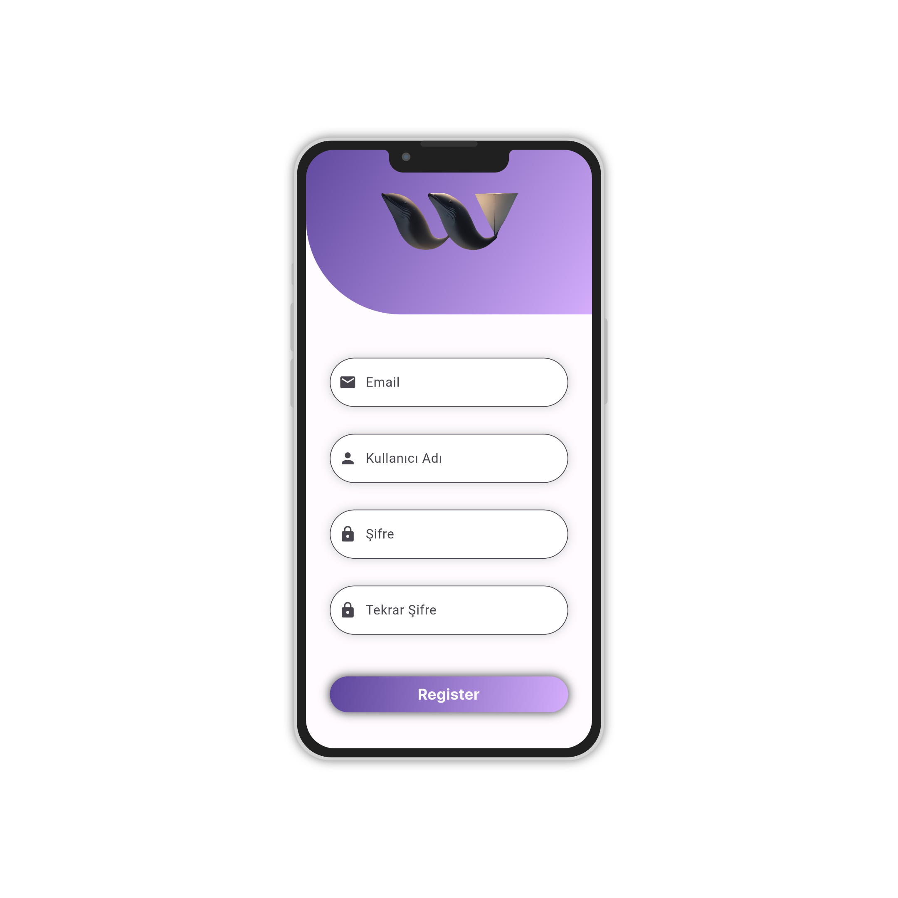

# WhimsiWalls

[](LICENSE)

WhimsiWalls, mobil cihazlar için yüksek kalitede duvar kağıtlarını sunan bir Flutter uygulamasıdır. Uygulama, kullanıcıların telefonlarına farklı kategorilerde güzel duvar kağıtları indirmelerine olanak sağlar. Ayrıca, kullanıcıların favori duvar kağıtlarını profil sayfasında saklamalarına ve paylaşmalarına olanak tanır.


## Özellikler

- Farklı kategorilerde yüzlerce yüksek kaliteli duvar kağıdı
- A.I Generated kategorisi ile yapay zeka tarafından üretilmiş görseller
- Stock kategorisi ile telefonların stok duvar kağıtları
- Profil sayfası ile kullanıcıların favori duvar kağıtlarını saklama ve paylaşma özelliği (Yakında eklenecek)
- Anon girişi ile kayıt olmadan da uygulamayı kullanabilme özelliği (Yakında eklenecek)

## Ekran Görüntüleri





## Kurulum

1. Projeyi klonlayın:

```
git clone https://github.com/kullaniciadi/WhimsiWalls.git
```

2. WhimsiWalls dizinine gidin:

```
cd WhimsiWalls
```

3. Gerekli bağımlılıkları yükleyin:

```
flutter pub get
```

4. Uygulamayı çalıştırın:

```
flutter run
```

## Firebase Yapılandırması

WhimsiWalls uygulaması, Firebase'i backend ve kullanıcı kimlik doğrulama işlemleri için kullanır. Uygulamayı kullanmak için kendi Firebase hesabınızı yapılandırmanız gerekmektedir. İşte adımlar:

1. [Firebase Console](https://console.firebase.google.com/) adresine gidin ve yeni bir proje oluşturun.
2. Firebase konsolunda proje oluşturduktan sonra, Android uygulaması için bir proje ekle seçeneğine tıklayın ve projenizi tanımlayın (paket adı gibi).
3. `google-services.json` dosyasını indirin ve `android/app` klasörüne yerleştirin.
4. Firebase konsolunda Authentication bölümüne gidin ve kullanıcı kimlik doğrulama yöntemlerini etkinleştirin.
5. Firestore veritabanınızı oluşturun ve Firestore kurallarınızı isteğe bağlı olarak yapılandırın.

Bu adımları tak

ip ederek, uygulamanızın Firebase ile bağlantısını yapılandırmış olursunuz. Kullanıcılar, uygulamayı kullanırken kendi Firebase hesaplarını kullanarak oturum açabilecek ve WhimsiWalls uygulamasını kullanabilecektir.

## Katkıda Bulunma

Katkıda bulunmak için lütfen önce [CONTRIBUTING](CONTRIBUTING.md) dosyasını okuyun. Daha sonra istediğiniz değişiklikleri yaparak bir PR (Pull Request) gönderebilirsiniz.

## Lisans

Bu proje MIT Lisansı altında lisanslanmıştır. Daha fazla bilgi için [LICENSE](LICENSE) dosyasına bakabilirsiniz.

---

© 2023 WhimsiWalls. Tüm hakları saklıdır.
