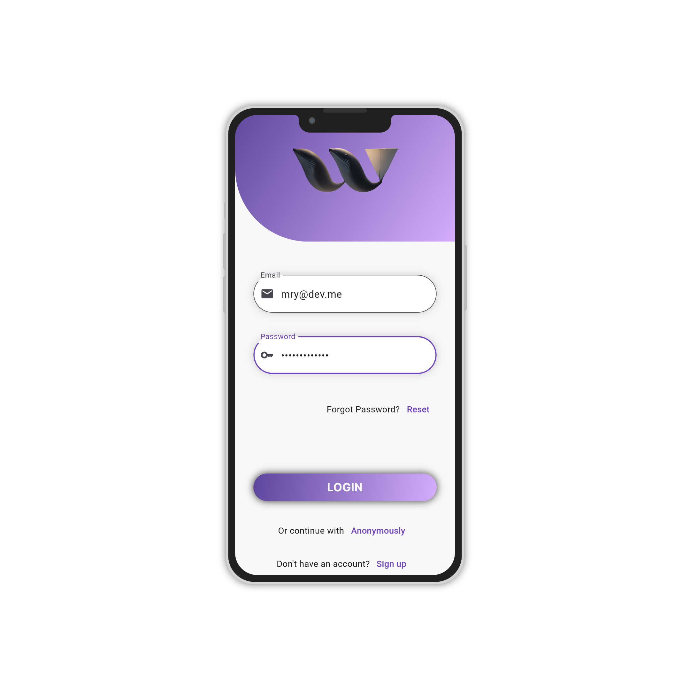

# WhimsiWalls

[](LICENSE)

**[Türkçe için buraya tıklayın](#whimsiwalls)** / **[Click here for English](#whimsiwalls)**

WhimsiWalls, mobil cihazlar için yüksek kalitede duvar kağıtlarını sunan bir Flutter uygulamasıdır. Uygulama, kullanıcıların telefonlarına farklı kategorilerde güzel duvar kağıtları indirmelerine olanak sağlar. Ayrıca, kullanıcıların favori duvar kağıtlarını profil sayfasında saklamalarına ve paylaşmalarına olanak tanır.


## Özellikler

- Farklı kategorilerde yüzlerce yüksek kaliteli duvar kağıdı
- A.I Generated kategorisi ile yapay zeka tarafından üretilmiş görseller
- Stock kategorisi ile telefonların stok duvar kağıtları
- Profil sayfası ile kullanıcıların favori duvar kağıtlarını saklama ve paylaşma özelliği (Yakında eklenecek)
- Anon girişi ile kayıt olmadan da uygulamayı kullanabilme özelliği (Yakında eklenecek)

## Ekran Görüntüleri




## Kurulum

1. Projeyi klonlayın:

```
git clone https://github.com/kullaniciadi/WhimsiWalls.git
```

2. WhimsiWalls dizinine gidin:

```
cd WhimsiWalls
```

3. Gerekli bağımlılıkları yükleyin:

```
flutter pub get
```

4. Uygulamayı çalıştırın:

```
flutter run
```

## Firebase Yapılandırması

WhimsiWalls uygulaması, Firebase'i backend ve kullanıcı kimlik doğrulama işlemleri için kullanır. Uygulamayı kullanmak için kendi Firebase hesabınızı yapılandırmanız gerekmektedir. İşte adımlar:

1. [Firebase Console](https://console.firebase.google.com/) adresine gidin ve yeni bir proje oluşturun.
2. Firebase konsolunda proje oluşturduktan sonra, Android uygulaması için bir proje ekle seçeneğine tıklayın ve projenizi tanımlayın (paket adı gibi).
3. `google-services.json` dosyasını indirin ve `android/app` klasörüne yerleştirin.
4. Firebase konsolunda Authentication bölümüne gidin ve kullanıcı kimlik doğrulama yö

ntemlerini etkinleştirin.
5. Firestore veritabanınızı oluşturun ve Firestore kurallarınızı isteğe bağlı olarak yapılandırın.

Bu adımları takip ederek, uygulamanızın Firebase ile bağlantısını yapılandırmış olursunuz. Kullanıcılar, uygulamayı kullanırken kendi Firebase hesaplarını kullanarak oturum açabilecek ve WhimsiWalls uygulamasını kullanabilecektir.

## Katkıda Bulunma

Katkıda bulunmak için lütfen önce [CONTRIBUTING](CONTRIBUTING.md) dosyasını okuyun. Daha sonra istediğiniz değişiklikleri yaparak bir PR (Pull Request) gönderebilirsiniz.

## Lisans

Bu proje MIT Lisansı altında lisanslanmıştır. Daha fazla bilgi için [LICENSE](LICENSE) dosyasına bakabilirsiniz.

---

© 2023 WhimsiWalls. Tüm hakları saklıdır.

---

# WhimsiWalls

[](LICENSE)

**[Türkçe için buraya tıklayın](#whimsiwalls)** / **[Click here for English](#whimsiwalls)**

WhimsiWalls is a Flutter application that provides high-quality wallpapers for mobile devices. The app allows users to download beautiful wallpapers in various categories. Additionally, users can save and share their favorite wallpapers on their profile page.


## Features

- Hundreds of high-quality wallpapers in different categories
- A.I Generated category with wallpapers generated by artificial intelligence
- Stock category with stock wallpapers from various devices
- Profile page for users to save and share their favorite wallpapers (Coming soon)
- Anonymous login feature for using the app without registration (Coming soon)

## Screenshots


## Installation

1. Clone the project:

   ```
   git clone https://github.com/kullaniciadi/WhimsiWalls.git
   ```

2. Navigate to the WhimsiWalls directory:

   ```
   cd WhimsiWalls
   ```

3. Install the required dependencies:

   ```
   flutter pub get
   ```

4. Run the application:

   ```
   flutter run
   ```

## Firebase Configuration

WhimsiWalls uses Firebase for backend and user authentication. To use the app, you need to configure your own Firebase account. Here are the steps:

1. Go to [Firebase Console](https://console.firebase.google.com/) and create a new project.
2. After creating the project in the Firebase console, click on "Add an app" for the Android application and provide the necessary details (e.g., package name).
3. Download the `google-services.json` file and place it in the `android/app` directory.
4. In the Firebase console, go to the Authentication section and enable the desired user authentication methods.
5. Create your Firestore database and optionally configure Firestore rules.

By following these steps, you will have configured the app with your own Firebase account. Users can then use their Firebase accounts to sign in and use the WhimsiWalls app.

## Contributing

Please read [CONTRIBUT

ING](CONTRIBUTING.md) for details on how to contribute to the project and submit pull requests.

## License

This project is licensed under the MIT License. See the [LICENSE](LICENSE) file for more information.

---

© 2023 WhimsiWalls. All rights reserved.

---
